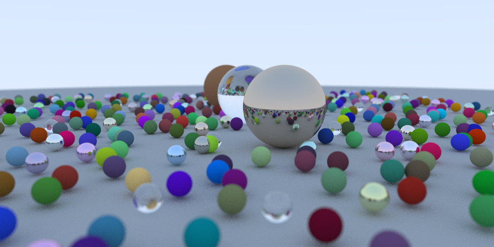
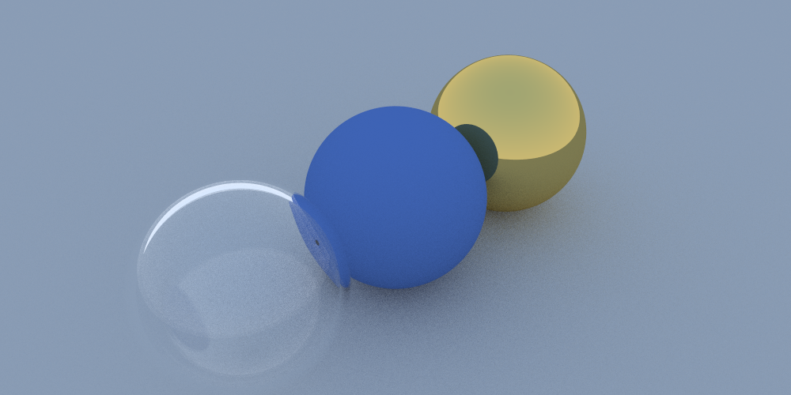

# Simple Path Tracer

A CPU-based path tracer written in C++14, following Peter Shirley's [*Ray Tracing in One Weekend*](https://raytracing.github.io/books/RayTracingInOneWeekend.html).

## About

I built this to learn the fundamentals of ray tracing and physically-based rendering. It follows the first book in Peter Shirley's ray tracing series and implements the full pipeline from ray-sphere intersection all the way to a final rendered PNG with multiple materials. The random scene generator produces the classic "lots of small spheres" cover image from the book, which was a satisfying milestone to hit.

## Features

- **Materials**: Lambertian (diffuse), Metal (with configurable fuzz), and Dielectric (glass with Schlick reflectance approximation and refraction)
- **Anti-aliasing**: Multi-sample per pixel (100 samples by default)
- **Gamma correction**: Applied with gamma = 2.0
- **Depth of field**: Configurable aperture and focus distance via a thin-lens camera model
- **Random scene generation**: Procedurally places hundreds of small spheres with randomized materials
- **PNG output**: Renders directly to PNG using stb_image_write (no PPM intermediate)
- **Recursive ray bouncing**: Configurable max depth (50 bounces by default)

## Built With

- [C++14](https://en.wikipedia.org/wiki/C%2B%2B)
- [stb_image / stb_image_write](https://github.com/nothings/stb) (vendored in `res/vendors/stb_image/`)

## Getting Started

### Prerequisites

- A C++ compiler with C++14 support (e.g., clang++, g++)
- [git](https://git-scm.com)

### Installation

Clone the repo:

```sh
git clone https://github.com/mosamaasif/RT_in_a_Weekend_Ipml.git
cd RT_in_a_Weekend_Ipml
```

### How to Run

From the project root, compile and run:

```sh
clang++ -std=c++14 -stdlib=libc++ \
  -I res/utils \
  -I res/vendors/stb_image \
  src/main.cpp res/utils/HittableList.cpp res/utils/Sphere.cpp \
  -o bin/release/main

./bin/release/main
```

The rendered image will be written to `output/out.png`.

**Note:** The build command above is for macOS with clang++. For other platforms or compilers (g++, MSVC), adjust the compiler and flags accordingly. A VS Code tasks.json with debug and release configurations is also included in `.vscode/`.

## Sample Renders

**Random scene** -- hundreds of diffuse, metal, and glass spheres with depth of field:



**Three spheres** -- Lambertian (blue), Metal (gold), and Dielectric (glass):


